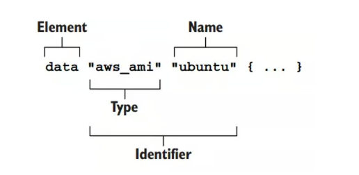
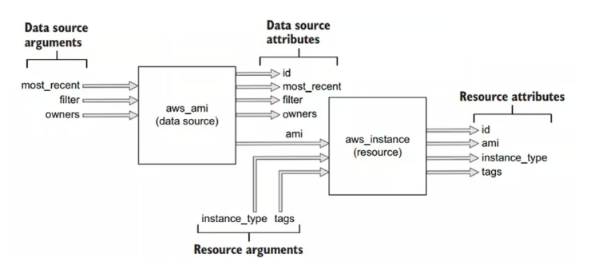

# Conquering Terraform: Setting Up a Project Directory and Writing Configuration

## Introduction

In the previous article, we discussed the concept of Infrastructure as Code and why we should use Terraform, as well as demonstrated a simple example of using Terraform. In this article, we will delve deeper into how to set up a project directory and write configuration files for Terraform.

## Table of Contents

- [Creating a Workspace and Writing Configuration](#creating-a-workspace-and-writing-configuration)
- [Initializing the Workspace](#initializing-the-workspace)
- [Checking Which Resources Will Be Created](#checking-which-resources-will-be-created)
- [Creating Resources](#creating-resources)
- [Managing Resource State](#managing-resource-state)
- [Conclusion](#conclusion)


## Creating a Workspace and Writing Configuration

Continuing with our simple example, we will create an EC2 instance on AWS Cloud. To create new infrastructure, follow these steps: Create a Workspace => write a configuration file => initialize the Workspace using `terraform init` => check which resources will be created using `terraform plan` => create resources using `terraform apply`.

First, let's create a Workspace, which is simply creating a folder. Create a folder named "ec2," and then create a file named "main.tf" (you can name it whatever you want) inside the folder. Paste the following code into it:

```hcl
provider "aws" {
  region = "us-west-2"
}

resource "aws_instance" "hello" {
  ami           = "ami-09dd2e08d601bff67"
  instance_type = "t2.micro"
  tags = {
    Name = "HelloWorld"
  }
}
```

Next, run the command `terraform init` to download the AWS provider into the current directory so that Terraform can use these providers and call AWS APIs to create resources for you. For the syntax and meanings of the syntax in the Terraform configuration, you can refer to the previous article.

## Initializing the Workspace

Run the command:

```bash
terraform init
```

This command initializes the backend and provider plugins, including installing the necessary AWS provider version.

After running the init command, you will see a directory named `.terraform` created. This directory contains the provider's code. The directory structure after running the init command will look like this:

```
├── .terraform
│   └── providers
│       └── registry.terraform.io
│           └── hashicorp
│               └── aws
│                   └── 3.68.0
│                       └── linux_amd64
│                           └── terraform-provider-aws_v3.68.0_x5
├── .terraform.lock.hcl
└── main.tf
```

## Checking Which Resources Will Be Created

After initializing the Workspace, before creating actual resources, it's a good practice to check which resources will be created. This step is not mandatory, but it's useful to review what will be created before applying changes to your infrastructure. To check the resources, run the command `terraform plan`.

```bash
terraform plan
```

The output will display the resources that will be created. Near the end of the output, you will see a line indicating how many resources will be added, changed, and destroyed. For example, "Plan: 1 to add, 0 to change, 0 to destroy."

In addition to showing the resources that will be created, this command also checks the syntax of the Terraform configuration file and reports errors if the syntax is incorrect.

If you have many resources and the plan command is slow, you can speed it up by using the `-parallelism=n` attribute. For example: `terraform plan -parallelism=2`.

If you want to save the result of the plan command, you can use the `-out` attribute when running it. For instance, you can save the plan result in a JSON file:

```bash
terraform plan -out plan.out
terraform show -json plan.out > plan.json
```

## Creating Resources

After reviewing the plan and ensuring everything is correct, you can proceed to create the resources using the following command:

```bash
terraform apply
```

Terraform will again display the execution plan, and it will ask for your confirmation before applying the changes. Enter "yes" to confirm and create the resources.

When the apply command is run, Terraform will first run the plan command again to show you what will be created, and then it will ask for confirmation before proceeding with the actual creation. If you don't confirm with "yes," no changes will be applied.

If you find it redundant that the apply command also runs a plan, you might wonder why run plan separately? The reason is that these commands are designed for CI/CD processes. You can run plan first with the `-out` attribute to preview the changes, and then use the result of the plan in the apply command:

```bash
terraform plan -out plan.out
terraform apply "plan.out"
```

After confirming with "yes" in the apply command, Terraform will create the resources as specified in your configuration.

Terraform will display the progress of resource creation, and when it's done, it will show a summary of what was added, changed, or destroyed.

## Managing Resource State

After Terraform is done creating resources, it will generate a file called `terraform.tfstate`. This file is used to store the current state of all resources managed by Terraform, allowing Terraform to track and manage them over time.

You have now successfully created an EC2 instance on AWS. To delete resources, you can use the `terraform destroy` command. This command will also run a plan to list the resources that will be deleted, and it will ask for confirmation. Once you confirm with "yes," Terraform will delete the specified resources.

Using a data block allows for more flexibility in your code.

## Data Blocks
### Introduction to Data Blocks

Data blocks in Terraform serve as a mechanism to call APIs on your infrastructure using your designated provider. They enable you to retrieve details about a particular resource without performing any actions that would create new resources on your infrastructure.

In this example, we will focus on the AWS provider to showcase how data blocks work.

### Example Usage

Consider the following Terraform configuration file (`main.tf`):

```hcl
provider "aws" {
  region = "us-west-2"
}

data "aws_ami" "ubuntu" {
  most_recent = true

  filter {
    name   = "name"
    values = ["ubuntu/images/hvm-ssd/ubuntu-focal-20.04-amd64-server-*"]
  }

  owners = ["099720109477"] # Canonical Ubuntu AWS account id
}

resource "aws_instance" "hello" {
  ami           = data.aws_ami.ubuntu.id
  instance_type = "t2.micro"
  tags = {
    Name = "HelloWorld"
  }
}
```
Illustration:



In this configuration, we are utilizing a data block to call the AWS Cloud API and retrieve information about an AMI (Amazon Machine Image). The subsequent resource block uses the data obtained from the data block to set the `ami` parameter for an AWS instance resource.

### Execution and Output

When you run the `terraform plan` command, the output will indicate that only one resource is being added due to the nature of the data block not creating new resources. Additionally, in the AMI field, the value obtained from the data block will be displayed.

```sh
terraform plan
```

Output:
```
Terraform used the selected providers to generate the following execution plan. Resource actions are indicated with the following symbols:
  + create

Terraform will perform the following actions:

  # aws_instance.hello will be created
  + resource "aws_instance" "hello" {
      + ami                                  = "ami-0892d3c7ee96c0bf7"
      ...
    }

Plan: 1 to add, 0 to change, 0 to destroy.
```

### Benefits of Using Data Blocks

Using data blocks in Terraform enhances code flexibility by allowing you to interact with APIs and retrieve information about resources without creating them. This flexibility simplifies the process of managing and configuring resources within your infrastructure.

Illustration:



By leveraging data blocks, you can optimize your Terraform configurations for efficient infrastructure management.

For more information and advanced use cases, refer to the official Terraform documentation.

_This README provides a basic introduction to using data blocks in Terraform. For more comprehensive guidance and additional examples, consult the official Terraform documentation._

## Conclusion

You have learned how to write Terraform configuration and which commands to use to create resources on your infrastructure. In the next article, we will explore the lifecycle of a resource in Terraform.