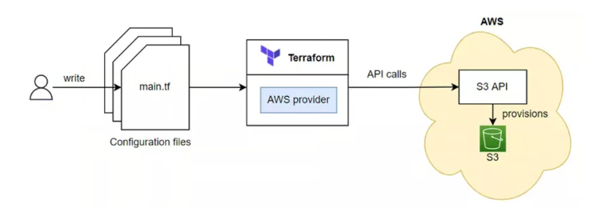

### Introduction

In a previous article, we explored initializing project directories and writing Terraform configuration files. In this installment, we delve into the lifecycle of a resource in Terraform. We will examine the steps that a resource goes through, from its creation to its deletion.

### Table of Contents

1. **Terraform Lifecycle Functions**
2. **Example Using S3**
3. **Planning**
4. **Creating an S3 Bucket**
5. **No-Op Operations**
6. **Updating an S3 Bucket**
7. **Deleting an S3 Bucket**
8. **Resource Drift**
9. **Conclusion**

### Terraform Lifecycle Functions

All Terraform resource types implement a CRUD (Create, Read, Update, Delete) interface. These functions, including Create(), Read(), Update(), and Delete(), are executed based on specific conditions. Data types in Terraform, on the other hand, implement a Read interface, featuring a Read() function.


The article visually represents these functions and their roles in the lifecycle.

### Example Using S3

We will use Terraform to create an AWS Simple Cloud Storage (S3) resource, enabling us to understand the resource lifecycle better.

Terraform S3:



### Planning

Before creating resources, it's essential to execute `terraform plan` to preview the resources that will be generated. This step is crucial as it provides insights into which resources will be created, updated, or left unchanged.

### Creating an S3 Bucket

By utilizing the Terraform code example provided in the article, we create an AWS S3 bucket. The `Create()` function is triggered during the apply process, leading to the actual resource creation. The Create() function in the aws_s3_bucket resource calls the necessary APIs to create the S3 bucket.

```
provider "aws" {
  region = "us-west-2"
}

resource "aws_s3_bucket" "terraform-bucket" {
  bucket = "terraform-series-bucket"

  tags = {
    Name        = "Terraform Series"
  }
}
```

Terraform create:


### No-Op Operations

If no changes have been made to the configuration, Terraform will proceed with a No-Op operation. The Read() function is executed, and if there are no differences between the current state and the desired state, no actions will be taken.

Terraform No-Op:


### Updating an S3 Bucket

Updating a resource in Terraform does not require a specific update command. Altering the configuration file and reapplying it using `terraform apply` prompts Terraform to assess whether an update is necessary. If changes are detected, Terraform executes the appropriate action (typically Update()).

```
provider "aws" {
  region = "us-west-2"
}

resource "aws_s3_bucket" "terraform-bucket" {
  bucket = "terraform-series-bucket-update"

  tags = {
    Name        = "Terraform Series"
  }
}
```

Terraform Update:


### Deleting an S3 Bucket

Resource deletion is achieved using the `terraform destroy` command. Terraform reads the state file and invokes the Delete() function of the relevant resource type to initiate the destruction process.

Terraform Delete:


### Resource Drift

Resource drift refers to discrepancies between the configuration in Terraform and changes made externally. Terraform detects these drifts and incorporates them into its planning process, enabling it to reconcile the configuration and the actual state.

### Conclusion

By comprehending the lifecycle of a resource in Terraform, you gain insights into how Terraform handles resource creation, updates, and deletion. This knowledge empowers you to effectively manage your infrastructure using Terraform's capabilities.

To delve deeper into functional programming within Terraform, proceed to the next article in the series.

_For a detailed walkthrough and complete information, refer to the original article "Vòng Đời Của Một Resource Trong Terraform" from the DevOps VN blog series._